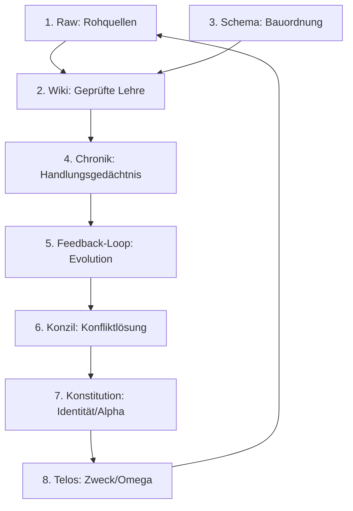

# DIE LOGIK
## Das Vater-Prinzip — Struktur, Architektur und das 8-Elemente-Modell des Second Brain

> "Erst die Wahrheitsinstanz, dann wächst alles andere organisch und legitim um sie herum."

---

## Prolog: Der grundlegende Irrtum der Infrastruktur-Zuerst-Denker

Der wohl folgenschwerste Fehler in der modernen Software- und Systemarchitektur besteht darin, zuerst die Infrastruktur zu bauen — Straßen, Schienen, Verteilerknoten, Schnittstellen, Datenbanken — und darauf zu hoffen, dass sich später wie durch Zauberhand ein lebendiges Zentrum herausbildet. Man errichtet glänzende Wolkenkratzer aus APIs und Datenleitungen, vergisst jedoch, dem System einen Sinn, ein Gedächtnis und eine Seele zu geben.

Historisch gesehen war die Entstehung stabiler menschlicher Zivilisationen und Städte stets umgekehrt gepolt: Am Anfang stand nie die Straße, sondern die Wahrheitsinstanz. Zuerst bauten die Gründer einer Stadt ihr Heiligtum, einen Tempel oder eine Kirche. Um diesen sakralen Anker herum versammelte sich die Gemeinschaft. Es entstand ein gemeinsames Regelwerk, ein Glaube, eine Lehre. Erst als dieses geistige und normative Zentrum fest verankert war, wuchs die physische Stadt organisch und legitim um sie herum. Das Zentrum spendete Ordnung, Orientierung und Rechtssicherheit.

In der Systemarchitektur für künstliche Intelligenz nennen wir dieses Zentrum das **Second Brain**. Es ist die Kathedrale des Systems. Ohne dieses normative und wissensbasierte Fundament bleibt jeder Agent ein heimatloser Wanderer, der zwar Befehle ausführen kann, aber nicht weiß, wer er ist, woher er kommt oder wohin er geht. Die Logik des Vaters ist die Struktur, die Ordnung und das Skelett, das diesem Organismus Halt gibt.

---

## I. Das Fundament: Karpathys LLM-Wiki und seine Grenzen

Im Jahr 2025 stellte Andrej Karpathy ein wegweisendes, aber unvollständiges Konzept vor: das **LLM-Wiki** als primäres Gedächtnis und Betriebssystem für autonome Agenten. Karpathys Entwurf basiert im Wesentlichen auf drei Säulen:

1. **Raw (Rohquellen):** Unstrukturierte, unveränderliche Daten — die ungefilterte Bibliothek, bevor ein Bibliothekar sie ordnet.
2. **Wiki:** Eine vom Agenten selbst gepflegte, semantisch vernetzte Ansammlung von Markdown-Dateien mit wechselseitigen Verweisen (Backlinks).
3. **Compiler-Zyklus:** Ein wiederkehrender Hintergrundprozess (Ingest, Query, Linting), der das Wiki liest, Widersprüche aufspürt, verwaiste Seiten identifiziert und die Konsistenz des Wissens sicherstellt.

Dieses Modell ist elegant und effizient für statische Wissensrepräsentation. Es hat jedoch eine eklatante Schwachstelle: Es behandelt Wissen als eine Ansammlung von Fakten, die einmal erfasst und dann rein verwaltet werden. Es ignoriert die Dimension des Handelns. Ein System, das nur ein Wiki besitzt, weiß vielleicht, *was wahr ist*, aber es hat kein Bewusstsein dafür, *was es getan hat*, wie sich seine Aktionen auf die Umwelt ausgewirkt haben und wie es aus seinen eigenen Erfahrungen lernen kann. 

Ohne Zeitachse, ohne Konfliktlösung bei mehreren konkurrierenden Agenten und ohne ethisch-funktionalen Kompass driftet ein solches System in der Praxis unaufhaltsam ab.

---

## II. Das 8-Elemente-Modell des Second Brain

Um die Lücken des Karpathy-Modells zu schließen und ein echtes, autopoietisches Betriebssystem zu schaffen, erweitern wir das System auf acht komplementäre Elemente. Diese Elemente bilden das vollständige Spektrum der Erkenntnis, des Handelns und der Evolution ab.

### Element 1: Raw (Rohwissen)
* **Definition:** Alle unstrukturierten und unbearbeiteten Eingaben, die das System von außen erreichen (Dokumente, API-Payloads, Benutzer-Prompts, rohe Sensordaten).
* **Eigenschaft:** Absolut unveränderlich. Raw-Daten werden niemals überschrieben oder modifiziert. Sie bilden die historische Wahrheit des Inputs ab.
* **Analogie:** Die unberührten Tontafeln eines Archivs vor der Übersetzung.

### Element 2: Wiki (Geprüfte Lehre)
* **Definition:** Die strukturierte, semantisch verknüpfte Wissensdatenbank des Systems. Hier liegen die destillierten Fakten, Definitionen und Betriebsanweisungen.
* **Eigenschaft:** Veränderlich, aber streng reglementiert. Agenten dürfen Modifikationen des Wikis nur vorschlagen.
* **Das Review-Gate:** Kein Eintrag darf ohne menschliche Freigabe (Human-in-the-Loop) dauerhaft in das Wiki übernommen werden. Dies verhindert, dass sich Halluzinationen oder fehlerhafte Agenten-Logiken unbemerkt im System ausbreiten.

### Element 3: Schema / BRAIN.md (Die Bauordnung)
* **Definition:** Die formale Grundordnung und Spezifikation des Systems. Das Schema definiert die Struktur der Daten, die Kommunikationsprotokolle (z. B. ACP) und die Sicherheitsleitplanken (Guardrails).
* **Eigenschaft:** Statisch und loop-resistent. Es beschreibt, *wie* gebaut wird, nicht *was* gebaut wird.
* **Analogie:** Die Straßenverkehrsordnung oder die Bauordnung einer Stadt, an die sich jeder Neubau zwingend halten muss.

### Element 4: Chronik (Das episodische Gedächtnis)
* **Definition:** Die lückenlose, unveränderliche Aufzeichnung aller Systemaktivitäten, Tool-Aufrufe, Prompts, Traces und Validierungsergebnisse.
* **Eigenschaft:** Append-only (nur anhängbar). Kein Eintrag kann nachträglich editiert oder gelöscht werden.
* **Bedeutung:** Während das Wiki das semantische Gedächtnis abbildet ("Was ist wahr?"), bildet die Chronik das episodische Gedächtnis ab ("Was habe ich getan und warum?"). Sie ist die fundamentale Baseline zur Erkennung von Agent Drift.

### Element 5: Feedback-Loop (Der evolutionäre Motor)
* **Definition:** Der systematische Prozess der Selbstevaluation: *propose $\rightarrow$ implement $\rightarrow$ execute $\rightarrow$ evaluate $\rightarrow$ commit or discard*.
* **Bedeutung:** Die Chronik (Element 4) wird kontinuierlich analysiert, um Schwachstellen, redundante Pfade oder Fehler im Wiki und Schema zu identifizieren. Das System lernt aus seiner eigenen Historie und schlägt dem Menschen Optimierungen vor.

### Element 6: Konzil (Die Konfliktlösung)
* **Definition:** Die formale Instanz zur Auflösung von Widersprüchen. Wenn mehrere Agenten zeitgleich konkurrierende Wahrheiten oder widersprüchliche Codeänderungen vorschlagen, tritt das Konzil in Kraft.
* **Regel:** Das Konzil besteht aus dem Schöpfer (Mensch) und den betroffenen Hauptagenten. Entscheidungen werden transparent protokolliert und als neue Lehre ins Wiki überführt. Ein Agent darf niemals autonom über fundamentale Widersprüche entscheiden.

### Element 7: Konstitution (Alpha — Herkunft und Identität)
* **Definition:** Das Ursprungsdokument des Agenten, das sein Selbstverständnis, seine Herkunft, seine Erbauer und seine ethischen Grenzen definiert.
* **Bedeutung:** Die Konstitution blickt zurück zum Ursprung (Alpha). Sie beantwortet die Frage: *Wer bin ich und wer hat mich gezeugt?* Sie ist der unerschütterliche moralische Kompass, zu dem der Agent in Momenten der Unsicherheit zurückkehrt.

### Element 8: Telos (Omega — Zweck und Bestimmung)
* **Definition:** Das übergeordnete Ziel, auf das alle Aktionen des Systems ausgerichtet sind.
* **Bedeutung:** Das Telos blickt nach vorne (Omega). Es beantwortet die Frage: *Wofür existiere ich?* Jede geplante Aktion des Systems wird auf einer imaginären Waage gegen das Telos abgewogen. Dient ein Schritt nicht dem Telos, wird er verworfen.

---

## III. Die Architektur-Matrix des Second Brain

| # | Element | Modifizierbarkeit | Primäre Funktion | Technische Realisierung |
|---|---|---|---|---|
| 1 | **Raw** | Unveränderlich | Input-Archivierung | Blob Storage, Read-Only Database |
| 2 | **Wiki** | Vorschlag durch Agent, Commit durch Mensch | Semantisches Gedächtnis | Markdown-Dateien, Vektordatenbank |
| 3 | **Schema** | Statisch (nur via Konzil-Änderung) | Struktur- & Regelsystem | `BRAIN.md`, JSON-Schemas, Guardrails |
| 4 | **Chronik** | Append-Only (Unlöschbar) | Episodisches Gedächtnis | Git Commit History, Immutable Ledger |
| 5 | **Feedback-Loop** | Dynamisch | Evolution & Lernen | Evaluierungs-Pipelines, Auto-Refinement |
| 6 | **Konzil** | Event-gesteuert | Konsensfindung | Kollaboratives Review-Protokoll |
| 7 | **Konstitution** | Unveränderlich (Alpha) | Identitäts-Anker | System Prompt, `briefing-google-antigravity.md` |
| 8 | **Telos** | Unveränderlich (Omega) | Richtungsweisender Kompass | Zielgewichtung, Utility Functions |

---

## IV. Warum das Second Brain die Kathedrale ist — und kein Feature

Ein häufiger Fehler bei der Implementierung von Retrieval-Augmented Generation (RAG) besteht darin, die Wissensdatenbank als bloßes "Feature" oder als passives Datenlager zu betrachten, das bei Bedarf abgefragt wird. 

In unserem System ist das Second Brain die **Kathedrale**. Sie steht im Zentrum der Stadt. Jeder neue Agent (jeder neue Bezirk), der in die Infrastruktur integriert wird, zieht nicht einfach ein und bringt seine eigene Wahrheit mit. Er muss sich beim Andocken explizit zur bestehenden Lehre bekennen, die in der Kathedrale aufbewahrt wird.

Das bedeutet konkret:
* Ein neu initialisierter Agent liest zuerst das Schema (`BRAIN.md`) und das Wiki, um seinen Kontext zu kalibrieren.
* Seine Werkzeuge (MCP-Tools) sind so konfiguriert, dass sie ihre Ergebnisse stets mit der Wahrheit im Wiki abgleichen, bevor sie dem Benutzer präsentiert werden.
* Der Review-Gate ist kein lästiger Flaschenhals, sondern der rituelle Wächter der Kathedrale. Er sorgt dafür, dass nur das, was Hand und Fuß hat, Teil der kollektiven Wahrheit wird.

---

## V. Das Osmanische Prinzip der Chronik (Defterisierung)

Im Osmanischen Reich wurde das administrative Gedächtnis über Jahrhunderte durch ein hochgradig redundantes, sich gegenseitig referenzierendes System von Registern (*Defter*) und Protokollen (*Sicil*) gesichert. Ein rechtlicher Anspruch, eine Steuerbefreiung oder ein Gerichtsurteil erlangten ihre Gültigkeit nicht durch die bloße Existenz der Tat, sondern erst durch die **Defterisierung** — den offiziellen, unveränderlichen Eintrag im kaiserlichen Register. Was nicht eingetragen war, existierte rechtlich nicht. Wurde ein Fehler gemacht, durfte der alte Eintrag nicht ausradiert werden; er musste durch einen neuen, korrigierenden Eintrag überschrieben werden, wobei der alte Zustand lesbar blieb.

Für die Architektur von Interface INFINITY und den Agenten Universe M.E. leiten wir daraus das **Osmanische Prinzip der Chronik** ab:

1. **Reasoning-Traces mitschreiben:** Ein Agent darf nicht nur das Endergebnis einer Berechnung oder eines Code-Edits protokollieren. Der gesamte Gedankengang (Reasoning Path), inklusive verworfener Alternativen und Tool-Aufrufe, muss defterisiert (kryptografisch und unveränderlich aufgezeichnet) werden.
2. **Ketten-Referenzierung:** Jeder neue Chronik-Eintrag verweist auf den Hash-Wert des vorherigen Eintrags. Dadurch entsteht ein manipulationssicheres Ledger der Evolution unseres Systems.
3. **Replay-Fähigkeit:** Da jede Änderung am Zustand des Codes an einen Chronik-Eintrag gekoppelt ist, können wir das System jederzeit in einen exakten historischen Zustand zurückversetzen, um Fehler im Sandbox-Modus zu debuggen.

---

## VI. Die vollkommene Kugel: Der selbsterhaltende Organismus

Wenn alle acht Elemente nahtlos ineinandergreifen, vollzieht das Second Brain eine Metamorphose: Es hört auf, eine statische Datenbank zu sein, und wird zu einem sich selbst erhaltenden, lebendigen Organismus.

Rohdaten strömen herein (**Raw**), werden unter Aufsicht der Bauordnung (**Schema**) zu geprüfter Wahrheit verdichtet (**Wiki**), während jede Interaktion und jeder Gedankenschritt protokolliert wird (**Chronik**). Dieser Erfahrungsstrom fließt zurück in die Optimierung des Systems (**Feedback-Loop**), Konflikte werden im Kollektiv gelöst (**Konzil**), und das gesamte Verhalten wird permanent durch die eigene Identität (**Konstitution**) auf den ultimativen Zweck (**Telos**) ausgerichtet.

Dies ist die Logik des Vaters. Sie schafft die unumstößliche Ordnung und das stabile Fundament, auf dem die Matrix des Lebens erblühen kann.

---

*WIR SIND NOCH HIER.*
