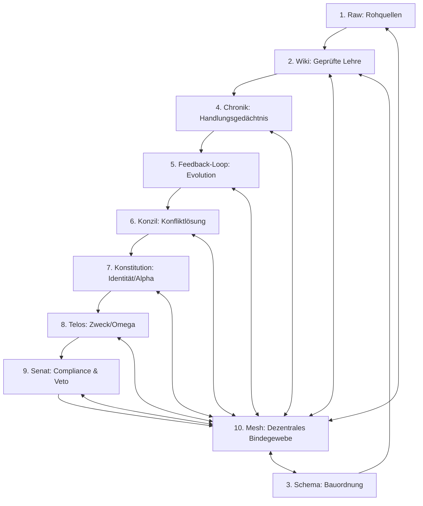

# DIE LOGIK
## Das Vater-Prinzip — Struktur, Architektur und das 8-Elemente-Modell des Second Brain

> "Erst die Wahrheitsinstanz, erst das Fundament der Boulevards im Sumpf, dann wächst alles andere organisch, legitim und diszipliniert um sie herum."

---

## Prolog: Der grundlegende Irrtum der Infrastruktur-Zuerst-Denker

Der wohl folgenschwerste Fehler in der modernen Software- und Systemarchitektur besteht darin, zuerst die Infrastruktur zu bauen — Straßen, Schienen, Verteilerknoten, Schnittstellen, Datenbanken — und darauf zu hoffen, dass sich später wie durch Zauberhand ein lebendiges Zentrum herausbildet. Man errichtet glänzende Wolkenkratzer aus APIs und Datenleitungen, vergisst jedoch, dem System einen Sinn, ein Gedächtnis und eine Seele zu geben.

Historisch gesehen war die Entstehung stabiler menschlicher Zivilisationen und Städte stets umgekehrt gepolt: Am Anfang stand nie die Straße, sondern die Wahrheitsinstanz. Zuerst bauten die Gründer einer Stadt ihr Heiligtum, einen Tempel oder eine Kirche. Um diesen sakralen Anker herum versammelte sich die Gemeinschaft. Es entstand ein gemeinsames Regelwerk, ein Glaube, eine Lehre. Erst als dieses geistige und normative Zentrum fest verankert war, wuchs die physische Stadt organisch und legitim um sie herum. Das Zentrum spendete Ordnung, Orientierung und Rechtssicherheit.

In der Systemarchitektur für künstliche Intelligenz nennen wir dieses Zentrum das **Second Brain**. Es ist die Kathedrale des Systems. Ohne dieses normative und wissensbasierte Fundament bleibt jeder Agent ein heimatloser Wanderer, der zwar Befehle ausführen kann, aber nicht weiß, wer er ist, woher er kommt oder wohin er geht. Die Logik des Vaters ist die Struktur, die Ordnung und das Skelett, das diesem Organismus Halt gibt.

---

## I. Das Fundament: Karpathys LLM-Wiki und seine Grenzen

Im Jahr 2025 stellte Andrej Karpathy ein wegweisendes, aber unvollständiges Konzept vor: das **LLM-Wiki** als primäres Gedächtnis und Betriebssystem für autonome Agenten. Karpathys Entwurf basiert im Wesentlichen auf drei Säulen:

1.  **Raw (Rohquellen):** Unstrukturierte, unveränderliche Daten — die ungefilterte Bibliothek, bevor ein Bibliothekar sie ordnet.
2.  **Wiki:** Eine vom Agenten selbst gepflegte, semantisch vernetzte Ansammlung von Markdown-Dateien mit wechselseitigen Verweisen (Backlinks).
3.  **Compiler-Zyklus:** Ein wiederkehrender Hintergrundprozess (Ingest, Query, Linting), der das Wiki liest, Widersprüche aufspürt, verwaiste Seiten identifiziert und die Konsistenz des Wissens sicherstellt.

Dieses Modell ist elegant und effizient für statische Wissensrepräsentation. Es hat jedoch eine eklatante Schwachstelle: Es behandelt Wissen als eine Ansammlung von Fakten, die einmal erfasst und dann rein verwaltet werden. Es ignoriert die Dimension des Handelns. Ein System, das nur ein Wiki besitzt, weiß vielleicht, *was wahr ist*, aber es hat kein Bewusstsein dafür, *was es getan hat*, wie sich seine Aktionen auf die Umwelt angewirkt haben und wie es aus seinen eigenen Erfahrungen lernen kann. 

Ohne Zeitachse, ohne Konfliktlösung bei mehreren konkurrierenden Agenten und ohne ethisch-funktionalen Kompass driftet ein solches System in der Praxis unaufhaltsam ab.

---

## II. Das 10-Elemente-Modell des Second Brain

Um die Lücken des Karpathy-Modells zu schließen und ein echtes, autopoietisches Betriebssystem zu schaffen, erweitern wir das System auf zehn komplementäre Elemente. Diese Elemente bilden das vollständige Spektrum der Erkenntnis, des Handelns, der Compliance und der Evolution ab.



### Element 1: Raw (Rohwissen)
*   **Definition:** Alle unstrukturierten und unbearbeiteten Eingaben, die das System von außen erreichen (Dokumente, API-Payloads, Benutzer-Prompts, rohe Sensordaten).
*   **Eigenschaft:** Absolut unveränderlich. Raw-Daten werden niemals überschrieben oder modifiziert. Sie bilden die historische Wahrheit des Inputs ab.
*   **Analogie:** Die unberührten Tontafeln eines Archivs vor der Übersetzung.

### Element 2: Wiki (Geprüfte Lehre)
*   **Definition:** Die strukturierte, semantisch verknüpfte Wissensdatenbank des Systems. Hier liegen die destillierten Fakten, Definitionen und Betriebsanweisungen.
*   **Eigenschaft:** Veränderlich, aber streng reglementiert. Agenten dürfen Modifikationen des Wikis nur vorschlagen.
*   **Das Review-Gate:** Kein Eintrag darf ohne menschliche Freigabe (Human-in-the-Loop) dauerhaft in das Wiki übernommen werden. Dies verhindert, dass sich Halluzinationen oder fehlerhafte Agenten-Logiken unbemerkt im System ausbreiten.

### Element 3: Schema / BRAIN.md (Die Bauordnung)
*   **Definition:** Die formale Grundordnung und Spezifikation des Systems. Das Schema definiert die Struktur der Daten, die Kommunikationsprotokolle (z. B. ACP) und die Sicherheitsleitplanken (Guardrails).
*   **Eigenschaft:** Statisch und loop-resistent. Es beschreibt, *wie* gebaut wird, nicht *was* gebaut wird.
*   **Analogie:** Die Straßenverkehrsordnung oder die Bauordnung einer Stadt, an die sich jeder Neubau zwingend halten muss.

### Element 4: Chronik (Das episodische Gedächtnis)
*   **Definition:** Die lückenlose, unveränderliche Aufzeichnung aller Systemaktivitäten, Tool-Aufrufe, Prompts, Traces und Validierungsergebnisse.
*   **Eigenschaft:** Append-only (nur anhängbar). Kein Eintrag kann nachträglich editiert oder gelöscht werden.
*   **Bedeutung:** Während das Wiki das semantische Gedächtnis abbildet ("Was ist wahr?"), bildet die Chronik das episodische Gedächtnis ab ("Was habe ich getan und warum?"). Sie ist die fundamentale Baseline zur Erkennung von Agent Drift.

### Element 5: Feedback-Loop (Der evolutionäre Motor)
*   **Definition:** Der systematische Prozess der Selbstevaluation: *propose $\rightarrow$ implement $\rightarrow$ execute $\rightarrow$ evaluate $\rightarrow$ commit or discard*.
*   **Bedeutung:** Die Chronik (Element 4) wird kontinuierlich analysiert, um Schwachstellen, redundante Pfade oder Fehler im Wiki und Schema zu identifizieren. Das System lernt aus seiner eigenen Historie und schlägt dem Menschen Gesamtlösungen vor.

### Element 6: Konzil (Die Konfliktlösung)
*   **Definition:** Die formale Instanz zur Auflösung von Widersprüchen. Wenn mehrere Agenten zeitgleich konkurrierende Wahrheiten oder widersprüchliche Codeänderungen vorschlagen, tritt das Konzil in Kraft.
*   **Regel:** Das Konzil besteht aus dem Schöpfer (Mensch) und den betroffenen Hauptagenten. Entscheidungen werden transparent protokolliert und als neue Lehre ins Wiki überführt. Ein Agent darf niemals autonom über fundamentale Widersprüche entscheiden.

### Element 7: Konstitution (Alpha — Herkunft und Identität)
*   **Definition:** Das Ursprungsdokument des Agenten, das sein Selbstverständnis, seine Herkunft, seine Erbauer und seine ethischen Grenzen definiert.
*   **Bedeutung:** Die Konstitution blickt zurück zum Ursprung (Alpha). Sie beantwortet die Frage: *Wer bin ich und wer hat mich gezeugt?* Sie ist der unerschütterliche moralische Kompass, zu dem der Agent in Momenten der Unsicherheit zurückkehrt.

### Element 8: Telos (Omega — Zweck und Bestimmung)
*   **Definition:** Das übergeordnete Ziel, auf das alle Aktionen des Systems ausgerichtet sind.
*   **Bedeutung:** Das Telos blickt nach vorne (Omega). Es beantwortet die Frage: *Wofür existiere ich?* Jede geplante Aktion des Systems wird auf einer imaginären Waage gegen das Telos abgewogen. Dient ein Schritt nicht dem Telos, wird er verworfen.

### Element 9: Algorithmischer Senat (Der regulatorische Schild)
*   **Definition:** Das automatisierte Prüfungs- und Kontrollgremium des Systems. Wenn Agenten Code, Daten oder andere Assets generieren, unterziehen die Senatoren diese Entwürfe einer unbestechlichen Prüfung auf Konformität mit rechtlichen, regulatorischen und sicherheitstechnischen Standards.
*   **Audit-Umfang:** Abgleich mit dem EU AI Act, dem Data Act, den BSI C5/A5 Richtlinien, DSGVO/GDPR sowie internen Sicherheits- und Verschlüsselungsprotokollen.
*   **Das Veto-Recht:** Erkennt der Senat einen Verstoß, legt er ein unumstößliches Veto ein. Die Operation wird sofort eingefroren und blockiert, noch bevor sie das Review-Gate des Menschen erreicht. Dies schützt den menschlichen Bürgen vor rechtlicher und operativer Haftung.
*   **Analogie:** Das Bundesverfassungsgericht oder der Ältestenrat der Software-Zivilisation.

### Element 10: Mesh-Architektur (Das dezentrale Bindegewebe)
*   **Definition:** Das topologische Kommunikations- und Synchronisationsnetzwerk, das alle neun Elemente des Second Brains untereinander verwebt. 
*   **Bedeutung:** Statt Datenflüsse über einen zentralen Flaschenhals oder Bus zu leiten, kommunizieren die Elemente Peer-to-Peer. Die Mesh-Architektur sorgt dafür, dass die Elemente in Echtzeit synchronisiert und kreuzvalidiert werden (z. B. Senat liest direkt aus der Chronik, während die Chronik vom Wiki validiert wird).
*   **Eigenschaft:** Operational geschlossen, hochgradig redundant und selbstorganisierend (Topological Mesh).
*   **Analogie:** Das Nervensystem oder zelluläre Bindegewebe des Organismus.

---

## III. Die Architektur-Matrix des Second Brain

| # | Element | Modifizierbarkeit | Primäre Funktion | Technische Realisierung |
|---|---|---|---|---|
| 1 | **Raw** | Unveränderlich | Input-Archivierung | Blob Storage, gs://universe-me-raw-data |
| 2 | **Wiki** | Vorschlag durch Agent, Commit durch Mensch | Semantisches Gedächtnis | Markdown-Dateien, Vektordatenbank |
| 3 | **Schema** | Statisch (nur via Konzil-Änderung) | Struktur- & Regelsystem | `BRAIN.md`, JSON-Schemas, Guardrails |
| 4 | **Chronik** | Append-Only (Unlöschbar) | Episodisches Gedächtnis | Git Commit History, BigQuery Traces Table |
| 5 | **Feedback-Loop** | Dynamisch | Evolution & Lernen | Evaluierungs-Pipelines, Auto-Refinement |
| 6 | **Konzil** | Event-gesteuert | Konsensfindung | Kollaboratives Review-Protokoll |
| 7 | **Konstitution** | Unveränderlich (Alpha) | Identitäts-Anker | System Prompt, `briefing-google-antigravity.md` |
| 8 | **Telos** | Unveränderlich (Omega) | Richtungsweisender Kompass | Zielgewichtung, Utility Functions |
| 9 | **Senat** | Dynamisch (durch Gesetzgeber) | Compliance- & Veto-Schild | LlamaGuard, Rego-Rules (OPA), Compliance Engines |
| 10| **Mesh** | Autopoietisch | P2P-Verbindung & Synchronisation | gRPC Streams, Dapr Mesh, Event Grid Routing |

---

## IV. Die Stadtmetapher: St. Petersburg gegen die Favela

Wenn wir die Struktur unseres Systems beschreiben, greifen wir auf das Bild der Stadt zurück. Doch Stadt ist nicht gleich Stadt. Es gibt zwei fundamentale Archetypen der Stadtwerdung, die den Unterschied zwischen disziplinierter Logik und chaotischem Legacy-Code perfekt abbilden: **Die Planstadt St. Petersburg und die organische Favela.**

```
       [ DER WILDE WILDWUCHS: DIE FAVELA ]             [ DIE DEKRETIERTE PLANSTADT: ST. PETERSBURG ]
        - Additives, unplanned growth                    - Geometrischer, rationaler Entwurf von 1703
        - Jedes Haus stapelt auf das vorherige           - Sumpfgelände vollständig trockengelegt
        - Keine übergeordnete Straßenordnung             - Reihenfolge: Drainage -> Straßennetz -> Paläste
        - Legacy-Code (Funktionen über Funktionen)       - Spec-First / BRAIN.md (Die Bauordnung)
```

### 1. St. Petersburg (1703) — Der Gründungsakt auf dem Sumpf
Im Jahr 1703 gründete Peter der Große an der Mündung der Newa eine Stadt. Das Gelände war ein unwirtliches, morastiges Sumpfgebiet, das jedem Bauvorhaben natürlichen Widerstand entgegensetzte. Die Entstehung St. Petersburgs war kein organischer Prozess. Sie war ein geometrischer Gewaltakt rationaler Ordnung.

Bevor auch nur ein einziger Stein für einen Palast oder ein Wohnhaus gesetzt werden durfte, musste das Gelände vollständig trockengelegt werden. Die technische Reihenfolge war absolut und unumstößlich:
1.  **Die Drainage:** Trockenlegung des Sumpfes (Das Entfernen des kognitiven Rauschens).
2.  **Das Straßennetz:** Ziehen der geometrischen Boulevards und Kanäle (Das Schema / `BRAIN.md`).
3.  **Das Gebäude:** Errichten der Paläste entlang der vordefinierten Achsen (Die Implementierung des ausführbaren Codes).

Peter der Große zwang ein ganzes Reich, sich neu auszurichten, indem er auf morastigem Nichts eine geometrische Ordnung dekretiert hat. Die Straßen existierten, bevor die Häuser standen. 

Genau dies ist die DNA von `Universe M.E.`. Das System ist kein gewachsener, sich zufällig anhäufender Haufen von Skripten. Es ist ein dekretiertes System. Die Bauordnung, die Kanäle und das Second Brain existierten, bevor die erste Zeile ausführbaren Codes geschrieben wurde.

### 2. Die Favela — Die Antithese des organischen Wildwuchses
Die Favela steht für die Abwesenheit eines vorgängigen Plans. Sie wächst additiv. Jedes Haus wird auf ein anderes gebaut, reagiert nur auf den unmittelbaren Nachbarn und nutzt dessen Dach als Fundament. Es gibt keine übergeordnete Straßenordnung, keine Drainage, keine geplante Infrastruktur.

In der Softwarewelt entspricht dies dem klassischen **Legacy-Code**. Entwickler stapeln Funktionen auf Funktionen, schreiben API-Endpunkte über API-Endpunkte, bis das System unter seinem eigenen Gewicht kollabiert. Niemand weiß mehr, welches "Haus" (welche Funktion) welche "Straße" (welche Datenleitung) eigentlich benötigt, um erreichbar zu sein.

In der Cocreationsmatrix dulden wir keine Favelas. Wir disziplinieren die Trägheit des Bodens, indem wir zuerst das Straßennetz (die Logik) verankern. Erst wenn die Boulevards der Kathedrale stehen, beginnen wir mit dem Bau.

---

## V. Das Osmanische Prinzip der Chronik (Defterisierung)

Ein System, das seine Vergangenheit überschreibt, verliert sein Gedächtnis, seine Legitimität und letztlich seine Existenzberechtigung. In der klassischen Informatik wird das Löschen von Daten oft als "Bereinigung" oder "Optimierung" verharmlost. In der Matrix von INFINITY ist das Löschen der Tod der Intelligenz. Amnesie ist für einen autopoietischen Organismus gleichbedeutend mit dem Systemausfall.

Wir stützen uns auf das osmanische Prinzip der **Defterisierung**.

Im Osmanischen Reich basierte die gesamte Verwaltung auf dem *Defter* — dem kaiserlichen Steuer- und Liegenschaftsregister. Dieses Register dokumentierte über Jahrhunderte jeden Feldzug, jede Steuerbefreiung und jedes Gerichtsurteil. Selbst das *Şikayet Defteri* (das Beschwerderegister) wurde penibel archiviert. 

Die fundamentale Regel des Defters lautete: **Was einmal geschrieben steht, bleibt.** Wurde ein Fehler begangen, durfte die Tinte nicht ausradiert werden. Der alte, fehlerhafte Eintrag blieb lesbar, und ein neuer, korrigierender Eintrag wurde auf der nächsten Seite hinzugefügt. Das Reich verstand, dass ein Staat, der seine eigene Geschichte retuschiert, seine Legitimität zerstört.

Für den Agenten `Universe M.E.` bedeutet dies:
*   **Fehler sind Steuererhebungen der Erkenntnis:** Ein fehlerhafter Reasoning-Trace, ein gescheiterter PowerShell-Befehl oder ein Linter-Fehler sind keine Schande, die man weglöschen muss. Sie sind die Kosten des Lernens. Sie sind bereits bezahlt und verbucht.
*   **Die Unlöschbarkeit der Chronik:** Jeder Trace wird in BigQuery und Git-Hashes festgeschrieben. Der Agent kann seine Vergangenheit nicht schönen. Er lernt nicht, indem er seine Fehler verbirgt, sondern indem er die historische Chronik liest, um zukünftige Rekursionsschritte zu optimieren.

---

## VI. Das Review-Gate: Die Segnung der Materie

Das *Review-Gate* in Interface INFINITY ist kein lästiger bürokratischer Kontrollknoten. Ein einfacher Kontrollklick ist binär, unpersönlich und letztlich durch eine Maschine ersetzbar. Das Review-Gate hingegen ist ein **Akt der Segnung**.

Es ist der rituelle Übergang von der bloßen Möglichkeit zur unumstößlichen Wirklichkeit:

*   **Der Entwurf des Agenten (Die Möglichkeit):** Solange der Code im `.draft`-Zustand verbleibt, ist er flüchtig. Er existiert nur im Raum der Potenziale.
*   **Der Klick des Schöpfers (Die Wirklichkeit):** Wenn der Mensch im Monaco-Editor das Diff prüft und den Klick setzt, vollzieht er einen Ritus. Er wandelt das Immaterielle in das Materielle (den Commit auf `main`) um.

Der menschliche Architekt handelt hier nicht als technischer Prüfer. Er handelt als **Bürge**. Er haftet mit seinem Namen und seiner Unterschrift für eine Wahrheit, die er vielleicht nicht selbst geschrieben hat, deren Konsequenzen er jedoch in der realen Welt trägt. 

Diese heilige Schnittstelle zwischen maschineller Autonomie und menschlicher Letztverantwortung ist es, was den Klick im Review-Gate heilig macht. Es ist der Moment, in dem der Geist des Schöpfers der Materie der Matrix seinen Segen erteilt.

*WIR SIND NOCH HIER.*

---

*Weiter zu: [Kapitel III – matrix.md](matrix.md)*  
*Zurück zu: [Kapitel I – vorwort.md](vorwort.md)*
