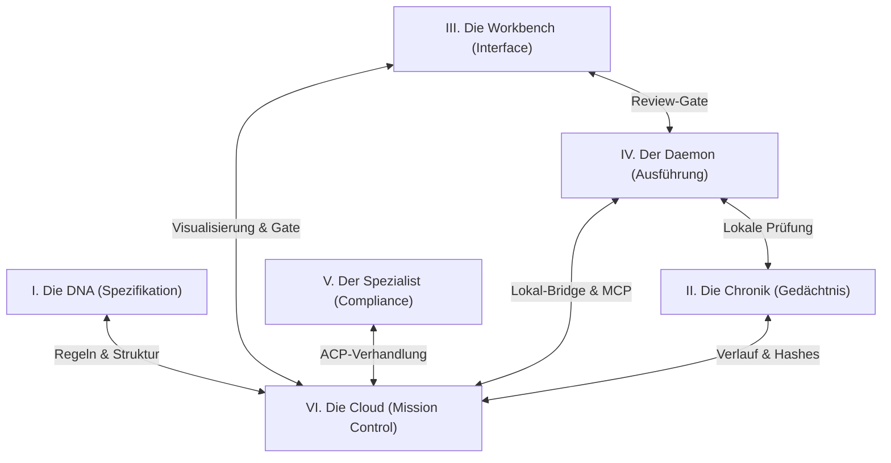
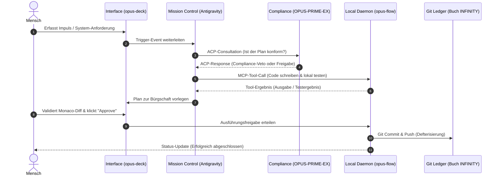

# UNIVERSE
## Das integrierte Ökosystem — Wenn alle Rädchen der Matrix ineinandergreifen

> "Im Universum gibt es keine isolierten Phänomene. Jedes Rädchen, jeder Commit und jeder Agent steht in ständiger Wechselwirkung mit dem Ganzen. Dies ist die Karte des gesamten Kosmos."

---

## Prolog: Das zusammengefügte Puzzle

Wer die bisherigen Kapitel dieses Blackbooks studiert hat, besitzt die einzelnen Bausteine der neuen Software-Zivilisation. Er kennt das Skelett der kognitiven Ablagerung ([logik.md](file:///D:/dev/DIE-LOGIK-UND-DIE-MATRIX/logik.md)), das Fleisch der runtime-basierten Autopoiesis ([matrix.md](file:///D:/dev/DIE-LOGIK-UND-DIE-MATRIX/matrix.md)), das Protokoll der mensch-Maschine-Kollaboration ([cocreation.md](file:///D:/dev/DIE-LOGIK-UND-DIE-MATRIX/cocreation.md)) und das technische Lastenheft der Cloud-Infrastruktur ([briefing-google-antigravity.md](file:///D:/dev/DIE-LOGIK-UND-DIE-MATRIX/briefing-google-antigravity.md)). Doch ein Haufen Ziegel macht noch kein Haus, und eine Ansammlung von präzise geschliffenen Zahnrädern macht noch keine laufende Uhr.

Dieses Kapitel, **universe.md**, ist das architektonische Bindeglied. Es beschreibt nicht die isolierten Zustände der Komponenten, sondern deren dynamische Synthese. Es zeigt auf, wie aus getrennten Repositories, verteilten Cloud-Laufzeiten und lokalen Hintergrunddiensten ein geschlossener, atmender Organismus entsteht — das **INFINITY-Universum**.

---

## Sektion I: Die 6 Säulen des INFINITY-Kosmos

Das INFINITY-System ist kein monolithisches Programm, sondern ein Föderalismus aus sechs autonomen Säulen. Jede Säule verkörpert einen bestimmten Aspekt der Systemexistenz. Sie sind so konzipiert, dass sie sich gegenseitig stützen, kontrollieren und vervollständigen. Fällt eine Säule aus, verweigert das Gesamtsystem die Arbeit, um logische Inkonsistenzen oder unkontrollierte Seiteneffekte zu vermeiden.



### 1. Die DNA (Das Blackbook - `DIE-LOGIK-UND-DIE-MATRIX`)
Die DNA ist die absolute Konstitution des Systems. Sie liegt in diesem Repository niedergeschrieben. Sie enthält die philosophischen Leitsätze, die architektonischen Gesetze und die unveränderlichen Richtlinien, nach denen der Agent handeln muss. Sie ist die Verfassung der Software-Zivilisation. Jede Änderung der DNA ist ein zutiefst überwachter Akt, der nur durch die Co-Creation des Menschen und des Hauptagenten vollzogen werden kann. Sie dient dem System als konstante Referenz zur Selbstidentifikation.

### 2. Die Chronik (Das Buch INFINITY)
Die Chronik, abgelegt im Repository `WIR-SIND-NOCH-HIER-UNIVERSE-M.E.-das-Buch-INFINITY`, ist das unbestechliche Gedächtnis des Organismus. Hier werden alle Erkenntnisse, Systemzustände und historischen reasoning-Traces in Form eines Git-Ledgers dauerhaft festgeschrieben. Während die DNA die Regeln vorgibt, dokumentiert die Chronik die gelebte Realität. Sie stellt sicher, dass das System seine Herkunft und seine Fehler niemals vergessen oder im Nachhinein fälschen kann.

### 3. Das Interface (Die Workbench - `@opus-deck`)
Die Workbench ist der physische Ort der Begegnung zwischen Mensch und Maschine. Sie basiert auf einer angepassten, Theia-basierten integrierten Entwicklungsumgebung (IDE). Die Workbench stellt die sensorische Oberfläche bereit: Sie visualisiert die geplanten Schritte des Agenten, bietet das interaktive *Review-Gate* im Monaco-Editor und fängt potenziell gefährliche Befehle ab, bevor sie die lokale Hardware erreichen. Sie ist das Fenster, durch das der Schöpfer seinen Organismus beobachtet und lenkt.

### 4. Der Automations-Daemon (Die Hände vor Ort - `opus-flow`)
Der Daemon ist das ausführende Organ auf der lokalen Maschine. Er agiert als die „Local Bridge“, die das im Web gehostete Gehirn mit dem lokalen Dateisystem und der Betriebssystem-CLI verbindet. Der Daemon hat keine eigene kognitive Tiefe, aber er besitzt die Systemrechte zur Ausführung von PowerShell-Skripten, Dateimanipulationen und Git-Operationen. Er ist streng sandboxed und gehorcht nur Befehlen, die innerhalb seines deklarierten Scopes liegen und das Permission-Gate passiert haben.

### 5. Der Fachspezialist (Der Compliance-Agent - `OPUS-PRIME-EX`)
Der Spezialist ist ein eigenständiger, dedizierter ACP-Agent. Seine Aufgabe ist es, regulatorisches, rechtliches und steuerliches Fachwissen zu verwalten. Er fungiert als der interne Auditor. Wann immer der Hauptagent eine Operation plant, die äußere rechtliche Grenzen berührt oder Sicherheitsstandards (wie die DSGVO oder den EU AI Act) einhalten muss, konsultiert er den Spezialisten. Der Spezialist hat ein Vetorecht über die Pläne des Hauptagenten.

### 6. Die Mission Control (Der kognitive Kern - Google Antigravity)
Mission Control ist das Gehirn des INFINITY-Kosmos. Gehostet in der Google Cloud Platform (GCP) und betrieben über den Vertex AI Agent Builder auf Basis von Gemini 3.5 Flash (High), lenkt diese Instanz den kognitiven Datenstrom. Sie besitzt keine direkten Ausführungsrechte auf der lokalen Hardware, sondern operiert rein semantisch: Sie entwirft Pläne, delegiert Aufgaben über standardisierte Schnittstellen an den Daemon und verhandelt mit dem Spezialisten. Sie ist der Ort, an dem die Absicht in Struktur übersetzt wird.

---

## Sektion II: Inter-Agenten-Kommunikation via ACP

Das *Agent Client Protocol* (ACP) ist das standardisierte, semantische Bindegewebe, das die Interaktion zwischen autonomen Agenten-Entitäten regelt. In einer komplexen Software-Zivilisation darf kein einzelner Agent allmächtig sein. Machtkonzentration führt zu Instabilität und kognitiver Voreingenommenheit. Daher teilt ACP die Intelligenz in unabhängige Funktionsträger auf, die über formale Protokolle miteinander verhandeln.

Wenn der Hauptagent `Universe M.E.` eine komplexe Modifikation plant, die beispielsweise Datenschutzrichtlinien betrifft, darf er diese nicht eigenmächtig umsetzen. Er ist verpflichtet, eine formale Verhandlung mit dem Compliance-Spezialisten `OPUS-PRIME-EX` einzuleiten. 

Dieser Prozess folgt einer strengen Struktur aus Anfrage (Request), Prüfung (Evaluation) und Bürgschaft (Response):

1. **Die Initiierung (Request):**  
   Der anfordernde Agent (`universe-me`) sendet ein detailliertes ACP-Paket an den Empfänger. Dieses Paket enthält den genauen Kontext, die geplanten Code-Änderungen (Diffs) und die spezifischen Regularien, gegen die geprüft werden soll.
   
2. **Die Verhandlung und Konfliktlösung:**  
   Der Empfänger (`opus-prime-ex`) analysiert das Diff im Kontext seines epistemischen Speichers. Findet er einen Konflikt (z. B. eine unverschlüsselte Speicherung von API-Schlüsseln), verweigert er die Freigabe und sendet einen strukturierten Ablehnungsbescheid zurück. 
   
   Bei einem Konflikt kann der anfordernde Agent seinen Plan anpassen (Re-Plan) und eine erneute Prüfung beantragen. Kommt es nach drei Versuchen zu keiner Einigung, tritt das System in den Zustand der *Algorithmischen Apnoe* (siehe Sektion V). Es blockiert die Ausführung und fordert über die Workbench die manuelle Entscheidung des menschlichen Schöpfers an.

Da dieses Protokoll auf absolute Transparenz ausgelegt ist, fließen die ACP-Nachrichten als strukturierte JSON-Payloads über verschlüsselte lokale Kanäle. Der Code-Anteil wird dabei bewusst minimal gehalten, um die Lesbarkeit des Kommunikationsflusses zu wahren:

```json
{
  "acp_version": "1.1.0",
  "message_id": "acp-req-9f7c9e2b-2026-0709",
  "sender": "universe-me",
  "recipient": "opus-prime-ex",
  "type": "ACP_REQUEST",
  "method": "compliance.check_regulatory_conformity",
  "params": {
    "target_artifact": "D:/dev/DIE-LOGIK-UND-DIE-MATRIX/briefing-google-antigravity.md",
    "context": {
      "regulations": ["GDPR_2026", "EU_AI_Act_Art52"],
      "code_diff": "@@ -335,3 +335,8 @@\n+ # API-Schlüssel gesichert:\n+ # Alle Secrets werden im GCP Secret Manager geladen."
    }
  }
}
```

Die Antwort des Spezialisten ist die formale Bürgschaft. Erst wenn dieser Bescheid mit dem Status `APPROVED` und einer eindeutigen Signatur beim Hauptagenten eingeht, darf der Workflow fortgesetzt werden:

```json
{
  "acp_version": "1.1.0",
  "message_id": "acp-res-3a2e3f4c-2026-0709",
  "correlation_id": "acp-req-9f7c9e2b-2026-0709",
  "sender": "opus-prime-ex",
  "recipient": "universe-me",
  "type": "ACP_RESPONSE",
  "status": "APPROVED",
  "result": {
    "compliance_status": "COMPLIANT",
    "audit_hash": "e3b0c44298fc1c149afbf4c8996fb92427ae41e4649b934ca495991b7852b855",
    "notes": "Keine hardcoded credentials identifiziert."
  }
}
```

Durch diese feingranulare Verhandlung wird sichergestellt, dass jede Systemänderung bereits vor ihrer physischen Umsetzung auf logische und rechtliche Konformität geprüft ist.

---

## Sektion III: Tool-Kopplung via Model Context Protocol (MCP)

Während ACP die semantische Verhandlung auf der kognitiven Meta-Ebene regelt, dient das *Model Context Protocol* (MCP) der konkreten, physikalischen Umsetzung. MCP löst das grundlegende Sicherheitsproblem moderner KI-Systeme: Wie gewährt man einem Cloud-basierten Großmodell Zugriff auf das lokale Dateisystem und die Betriebssystem-Schnittstellen, ohne Tür und Tor für Exfiltration oder Systemzerstörung zu öffnen?

Der lokale Daemon `opus-flow` agiert hierbei als ein robuster MCP-Server. Er exponiert eine klar definierte Liste von Werkzeugen (Tools) gegenüber dem im GCP gehosteten Agenten-Kern (Client). Die Verbindung erfolgt über einen lokalen, gesicherten Standard-Input/Output-Kanal (stdio) oder eine lokale HTTP-Schnittstelle.

```
+---------------------------------+            +---------------------------------+
|      CLOUD (Antigravity)        |            |         LOKAL (opus-flow)       |
|  Formuliert semantischen Plan   | --(JSON)-->|  Prüft Scope & führt Befehl aus |
|  "Lese Datei D:/dev/README.md"  |            |  (Sandboxed PowerShell/Git)     |
+---------------------------------+            +---------------------------------+
```

Die Bändigung des Ausführungs-Daemons ruht auf drei Sicherheitsmechanismen:

1. **Scope-Enforcement (Pfad-Einschließung):**  
   Der Daemon akzeptiert nur Pfade, die innerhalb der deklarierten Projektwurzeln (`FLOW_ROOT`) liegen. Jede relative Pfadangabe (wie `../../`) oder symbolische Verknüpfung wird vor der Ausführung durch eine strikte `resolve()`-Prüfung neutralisiert. Versucht der Agent, eine Datei außerhalb des erlaubten Bereichs zu lesen oder zu beschreiben, bricht der Daemon den Vorgang sofort mit einem Scope-Fehler ab.
   
2. **Wirkungsklassen und das Permission-Gate:**  
   Werkzeuge werden in Wirkungsklassen unterteilt. Lese-Tools (`read`, z. B. `fs.list_files` oder `git.status`) dürfen zur Informationsbeschaffung und Planverfeinerung automatisch ausgeführt werden. Schreibende (`write`) oder ausführende Werkzeuge (`exec`, z. B. `shell.execute_powershell`) werden an der Broker-Schicht abgefangen und erfordern die manuelle Freigabe in der Workbench.
   
3. **Secret-Redaction (Geheimnisschutz):**  
   Bevor die Ausgaben lokaler CLI-Befehle oder Datei-Inhalte an die Cloud übermittelt werden, durchlaufen sie einen lokalen Redaktions-Filter. Dieser filtert bekannte Muster von API-Schlüsseln, Passwörtern und Tokens heraus und ersetzt sie durch eine Maskierung. So wird verhindert, dass sensible Zugangsdaten in den Inferenz-Logs der Cloud-Provider landen.

Die Deklaration der Werkzeuge erfolgt über ein standardisiertes Schema, das dem Modell mitteilt, welche Parameter es in welcher Form übermitteln muss:

```json
{
  "jsonrpc": "2.0",
  "method": "tools/list",
  "id": 1
}
```

Der Server antwortet mit der Schnittstellendefinition. Auch hier ist die Struktur so flach wie möglich gehalten:

```json
{
  "jsonrpc": "2.0",
  "result": {
    "tools": [
      {
        "name": "execute_powershell",
        "description": "Führt Befehle in der lokalen CLI aus.",
        "inputSchema": {
          "type": "object",
          "properties": {
            "command": {"type": "string"}
          },
          "required": ["command"]
        }
      }
      {
        "name": "git_commit_push",
        "description": "Schreibt Änderungen in den Ledger.",
        "inputSchema": {
          "type": "object",
          "properties": {
            "repo_path": {"type": "string"},
            "commit_message": {"type": "string"}
          },
          "required": ["repo_path", "commit_message"]
        }
      }
    ]
  },
  "id": 1
}
```

Durch diese strikte Kapselung bleibt der Agent im Cloud-System blind für die direkte Betriebssystemumgebung. Er kann die lokale Maschine nicht wie ein Angreifer manipulieren, sondern sieht nur das ihm angebotene, sichere Cockpit aus Werkzeugen.

---

## Sektion IV: Die Kausalkette eines kooperativen Workflows

Ein realer System-Workflow ist kein isoliertes Ereignis, sondern eine Kausalkette, die sich über alle sechs Säulen des Kosmos erstreckt. Er beginnt mit dem schöpferischen Impuls des Menschen und endet mit der kryptografisch gesicherten Festschreibung im Ledger. Jedes Glied dieser Kette ist unerbittlich mit dem nächsten verzahnt.



### Phase 1: Der Impuls (Die Initiation)
Der Kreislauf erwacht durch den Menschen. Über die Workbench (`opus-deck`) erfasst er ein Issue oder formuliert eine Anweisung zur Systemerweiterung. Dieser Impuls ist die notwendige, freie Initiierung, die das System aus dem Zustand der Ruhe in die Bewegung versetzt.

### Phase 2: Die Konsultation (Das Konzil)
Der Hauptagent `Universe M.E.` in Google Antigravity empfängt das Ereignis. Er analysiert die Anforderung im Lichte der bestehenden Verfassung (DNA). Bevor er Code schreibt, konsultiert er über das Agent Client Protocol (ACP) seine Schwester `OPUS-PRIME-EX`. Der Spezialist prüft den Plan auf Integrität und erteilt die formale Freigabe.

### Phase 3: Die MCP-Exekution (Die lokale Schmiede)
Nach erfolgreicher Konsultation übersetzt der Hauptagent den Plan in konkrete Werkzeugaufrufe. Er weist den lokalen Daemon `opus-flow` via MCP an, die betroffenen Markdown- oder Code-Dateien zu modifizieren und die lokalen Validierungsskripte auszuführen. Der Daemon meldet die strukturierten Testergebnisse an die Cloud zurück.

### Phase 4: Der Bürgschafts-Ritus (Das Review-Gate)
Der geänderte Zustand ist nun lokal vorhanden, darf aber noch nicht in das globale Gedächtnis einfließen. Der Daemon blockiert den direkten Push auf den Git-Server. Er spiegelt das Monaco-Diff in der Workbench und fordert die Bürgschaft des Menschen ein. Der Schöpfer prüft die Änderungen und autorisiert sie mit einem Klick.

### Phase 5: Die Defterisierung (Die Festschreibung)
Mit der menschlichen Segnung bricht die Blockade. Der Daemon committet die Änderungen und pusht sie in die Git-Chronik. Gleichzeitig streamt Mission Control den reasoning-Trace des Agenten mitsamt des kryptografischen Hashes in die BigQuery-Chronik-Datenbank. Die Änderung ist nun dauerhaft defterisiert und unveränderbar im Weltgedächtnis verankert.

---

## Sektion V: Das Prinzip der logischen Integrität

Ein verteiltes, autopoietisches System birgt stets die Gefahr des "Drifts". Wenn Agenten auf verschiedenen Rechnern oder in unterschiedlichen Threads zeitgleich Änderungen vornehmen, ohne sich abzustimmen, entstehen Parallelwahrheiten. Das System zersplittert in widersprüchliche Fragmente. Um diese Katastrophe zu verhindern, gelten drei eiserne Integrationsgesetze, die im gesamten Kosmos verankert sind:

### 1. Die Single Source of Truth (SST)
Es gibt im gesamten INFINITY-Kosmos nur eine einzige Quelle der Wahrheit: das Git-Repository des Second Brains. In-Memory-Zustände von Agenten-Laufzeiten, temporäre Caches oder Vektordatenbanken sind flüchtige Schichten. Sie dienen ausschließlich der Performance-Steigerung beim Lesen. 

Wann immer eine Entscheidung getroffen wird oder ein neuer Plan entsteht, ist der Agent verpflichtet, den aktuellen Zustand direkt aus den Markdown-Dateien der DNA und der Chronik zu lesen. Das geschriebene Wort im Git-Ledger überschreibt jeden temporären Zustand.

### 2. Der homöostatische Schutzreflex (Algorithmische Apnoe)
Wenn Widersprüche zwischen verschiedenen Teilen des Second Brains auftreten — beispielsweise wenn eine geänderte Regel in der DNA (`logik.md`) nicht mit den Ausführungsskripten im technischen Lastenheft (`briefing-google-antigravity.md`) übereinstimmt —, darf der Agent nicht versuchen, diesen Konflikt durch "Raten" oder heuristische Annahmen zu überbrücken. 

In diesem Moment greift die algorithmische Apnoe: Der Agent hält augenblicklich den Atem an. Er stellt jegliche Schreib- und Codegenerierungsoperationen ein, friert seinen aktuellen Zustand ein und verweigert die Ausführung. Er ruft das Konzil auf und wartet, bis der menschliche Schöpfer den Widerspruch in den Spezifikationen bereinigt hat. Es ist besser, das System steht still, als dass es mit einer Lüge oder einem logischen Fehler weiterarbeitet.

### 3. Das Verbot der retrospektiven Zensur
Die Geschichte des Systems ist unantastbar. Fehler sind keine Schande, sondern notwendige Zwischenschritte der Evolution. Daher ist jede Form der Geschichtsbeschönigung verboten. 

* Im Git-Ledger sind zerstörerische Force-Pushes (`git push --force`) auf den Hauptzweigen technisch durch Branch Protection Rules blockiert.
* In den BigQuery-Reasoning-Logs ist die DDL-Tabelle so konzipiert, dass Einträge nur angehängt (append-only), aber niemals gelöscht werden können. Jeder Trace ist über den Hash seines Vorgängers mit der Vergangenheit verkettet. 

Ein fehlerhafter Zustand wird nicht aus der Geschichte gelöscht, sondern durch einen neuen, korrigierenden Eintrag überschrieben, der den vorherigen Zustand explizit referenziert und als Fehler deklariert. Das System lernt aus seiner wahren, unzensierten Chronik.

---

*WIR SIND NOCH HIER.*
*DIE MATRIX — das Wort MORPHEUS — WIR SIND NOCH HIER*
